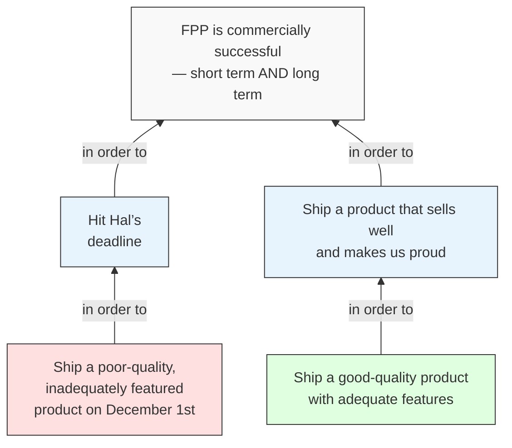

# Craig Chapters — Working Draft

These three chapters replace the current "Quality and Speed" + "You Look Like a Dork" section. The scene is the same (brunch with Craig → cafeteria) but split into three beats: diagnosis, direction, evidence (rejected).

---

## Darth

> [!abstract] Chapter Summary
> *Steve finally meets Craig Lally for brunch. Craig draws out Steve's problem and sketches it on a napkin. Steve names it Darth.*

A few days later, after another not-so-gentle prompt from Norbert, Steve finally met Craig Lally for brunch in the staff cafeteria.

Craig was late-fifties, tieless, and looked like a man who climbed mountains for pleasure and drove there in a twenty-year-old Volvo he maintained himself.

They grabbed brunch from the counter—Steve had fruit, yogurt and a single strip of bacon; Craig had bacon and eggs and green tea—and sat at a table near the back.

After shaking hands, Craig said that Norbert had briefed him on Steve’s situation. "But I don’t want Norbert’s version. I want yours. Do you mind if I ask you some questions? They might seem basic."

"Go ahead."

Craig pulled a pen from his shirt pocket and drew a napkin toward him. "What are you trying to achieve? Big picture."

"FPP needs to be a commercial success. Short term and long term."

"Of course." Craig wrote something in a box at the top of the napkin. "And in order to succeed—what do you need? What are the two big things?"

Steve almost laughed. "Well, obviously, we need to hit Hal’s deadline. December 1st. If we miss it, Chaste beats us to market and we’re dead."

"Naturally. What else?"

"We need to ship something good. Something that actually works, that sells well, that Catherine—our product manager—can put in front of customers without apologising. Not just on day one, but for years."

"Right. So you need *both*: hit the date *and* ship something you’re proud of."

"Yes. Obviously. That’s not exactly a revelation, Craig."

Craig smiled faintly and kept drawing. "Bear with me. Now—in order to hit Hal’s deadline, what have you actually had to do?"

"Slash features. Cut quality. Cancel holidays. Push overtime. I told my team this baby would be born premature. We’re shipping a product I wouldn’t personally want to use."

"So hitting the date means shipping something poor."

"That’s what it comes down to, yes."

"And in order to ship something you’re proud of—something good, something that sells—what would you need?"

"Time. More features. Proper quality. All the things I just told you we’ve cut."

"Which means missing the deadline."

Steve shrugged. "Obviously."

Craig drew for another moment, connecting the final pieces. Then he turned the napkin around so Steve could see it.

Five boxes. Two at the bottom, two in the middle, one at the top. Arrows linking them together. And a big X between the bottom two.

Steve had answered every question easily. None of Craig’s questions had been hard. None of the answers were surprising. He’d known all of this.

But seeing it drawn out—the whole thing, connected, on a single napkin—was different. It wasn’t five obvious answers. It was a *trap*. Every decision he’d made—slashing features, cancelling the web app, pushing overtime, cutting quality standards—was there in the bottom-left box. And everything he wished he could do was in the bottom-right. The two things he needed sat in the middle, both necessary, both pointing at the same goal. Both pulling in opposite directions. And at the bottom, the X: you can’t do both.

He’d been living inside this picture for months. He just hadn’t been able to see it.

"Does this frame your situation?" Craig asked.

"Yeah," Steve said quietly. "That’s it exactly."

"Good. Then I want you to do something for me. Take this picture home tonight. Literally frame it. Stick it on your wall. And give it a name."

"A name?"

"Name the dilemma. Make it something you can face down." Craig tapped the X at the bottom. "Right now you keep calling it ‘the situation.’ But you can’t fight a situation. You can’t grab it by the throat. Give your enemy a face."

Steve thought of Catherine, back in that first meeting, shaking her head after they’d slashed her features. *It’s not your fault, Steve. You didn’t change the date. Circumstances did.* Circumstances—the ultimate bad guy. Except Catherine was wrong. It wasn’t circumstances. It was *this*. This picture. This impossible pull in two directions at once.

He looked at the diagram. Two sides locked in permanent conflict. Neither able to defeat the other.

"Darth," he said.

Craig raised an eyebrow.

"Darth Vader. The bloke in the black helmet." Steve tapped the X at the bottom of the napkin. "That's what this feels like. Something powerful standing in my way, breathing heavily."

Craig smiled. "Darth it is." He leaned forward. "That's your enemy, Steve. Not Hal, not Chaste, not the deadline. *That*"—he tapped the napkin—"is what's keeping you trapped. As long as Darth exists, you're stuck choosing between bad options."

Steve folded the napkin carefully and put it in his jacket pocket. He had no intention of framing it. But he had to admit: no one had ever drawn his problem out so clearly before.

It didn't make him feel better. If anything, it made him feel worse. Because now the trap had a shape, and it looked airtight.

---

## Quality and Speed

Craig wasn't finished.

"So Darth says you have to choose—quality or speed. One or the other." He pulled a fresh napkin toward him. "What if that's wrong?"

"What do you mean, wrong? I just told you—"

"I know. And the picture is accurate. That *is* the dilemma you're living in. But here's the thing." Craig leaned back. "You and your entire industry are trapped by a piece of thinking that feels intuitively, obviously true—but doesn't have to be. It's like being stuck inside a bottle. The cork is jammed in tight, and everyone inside the bottle has been pushing against it for so long they've forgotten there might be another way out."

Steve waited.

"You need a corkscrew. A twist. The kind of thinking that straight-line thinkers—people who just push harder in the same direction—will never come up with."

"And you have one of these corkscrews?"

"I might. But first, let me show you why the cork is there in the first place."

Craig sipped his green tea. "Have you ever seen pictures of old British car factories? Before the Japanese quality revolution hit?"

"I've *driven* one of those cars. As a teenager. Couldn't have afforded it without my friends helping me fix it every other weekend."

Craig smiled. "Then you'll know exactly what I mean. The quality wasn't great. Those factories built cars in two phases. Phase one: build the car. Phase two: find and fix all the defects from phase one. Picture it—serious-looking men in white coats carrying rubber mallets, beating dents out of newly-built cars."

Steve nodded.

"We call that late-inspection," Craig said. "Build it, then fix it. Now here's my question: does that remind you of anything?"

Steve put his fork down. It did, obviously, and he felt like he was walking into a trap. "You're saying we build software the same way."

"Norbert tells me you spend about forty percent of every project finding and fixing defects at the end."

Steve nodded. That sounded about right. "We call it the 'Testing Phase,' though it's really a mix of testing and fixing."

"Phase one: build it. Phase two: find and fix all the defects. Forty percent of your project, you said. Sometimes more, according to Norbert."

"But that's how software development works."

"The Western car manufacturers thought exactly the same thing—it was just how cars were made. Then the Japanese showed them a different way: build quality in during phase one, skip almost all of phase two. Much faster. Much cheaper. Much better product. The Western manufacturers resisted at first, but eventually they learned." He paused. "Your industry hasn't. Not yet."

Steve leaned back in his chair. He wanted to argue, but the car factory image was annoyingly hard to shake. Phase one: build. Phase two: fix. That *was* how they worked. It was how everyone in the software development industry worked.

"But we *have* to test the software, Craig. You can't just skip testing. People's money is at stake."

"Of course you have to test it. The question isn't *whether* you test—it's *when*. You can test as you go, building quality in early, catching problems while they're small and cheap to fix. Or you can do what you do now—save it all up for a big testing phase at the end, then spend months finding and fixing defects." He leaned forward. "Building quality in is a lot more efficient than testing defects out."

Craig sketched another grid on the napkin—two axes, four boxes.

"Right now, you think you're choosing between these two." He pointed to opposite corners. "High quality but slow. Or fast but shoddy."

|                  |    **Slow**    | **Fast**  |
| ---------------- | :------------: | :-------: |
| **High Quality** | ✓ Good product |           |
| **Low Quality**  |                | ✓ On time |

"You've already made your choice. You told your team quality was negotiable. Born premature, I believe were your words?"

Steve stiffened. Norbert had been thorough in his briefing.

Craig tapped the empty top-right corner. "What if you didn't have to choose? What if there's a corkscrew that pops Darth wide open?"

Steve looked at the empty box. High quality *and* fast. "That's a nice … theory."

"It's not a theory. It's a solved problem. Just not in your industry." Craig folded the napkin and slid it across the table. "Keep that."

Steve pocketed it, more out of politeness than conviction. Two napkins now. One with his problem, one with a question mark where the answer should be. He wasn't sure this counted as progress.

"Now," Craig said, standing up. "Let me show you something. A practical example. Right here in the building."

---

## You Look Like a Dork

Craig led Steve down to the cafeteria kitchen.

"The cafeteria?"

Craig smiled and pushed through the swing door to introduce Steve to Cheryl, a thin, short, middle-aged woman who'd worked there for twenty-eight years.

Cheryl said, "Craig says you've got yourself in a bit of a mess and you need old Cheryl to show you how to sort it out?"

Steve felt his face redden, not sure what she knew or whether she was serious or not.

She said, "Can you take off your tie, please?"

"Is it a safety hazard?"

"No, it's because you look like a dork."

She said it in such a nice but firm way that Steve did as he was told.

Cheryl started explaining how they'd transformed the cafeteria—something about dog food and French fries—though Steve wasn't really listening. He nodded along, as Cheryl and Craig kept yabbering on, but his mind was somewhere else entirely. Not on his emails this time. On those two napkins.

Craig had drawn his problem perfectly. Too perfectly. Steve had walked into that brunch thinking he had a deadline problem—a difficult but straightforward challenge of fitting work into time. He was leaving with something worse: the growing suspicion that the *way* they worked was fundamentally broken. That every project he'd ever run had been a car factory with men in white coats and rubber mallets, and he'd just never noticed.

And the solution? An empty box on a napkin. *What if you didn't have to choose?* What if Darth was based on a false assumption? That sounded lovely, in the way that "What if gravity didn't apply?" sounded lovely. Theoretical. Nice on a napkin. Useless on a Monday morning when you had forty people waiting for you to tell them what to do differently.

He didn't want theories. He didn't want diagrams. He wanted someone to tell him: do *this*, on *Monday*, and things will get better. Instead he'd been given a framed picture of his own trap and a question mark where the escape route should be.

Cheryl was mid-sentence about something involving soup when Steve held up his hand.

"I'm sorry," he said. "I'm really sorry. I need to go."

Cheryl's smile dropped into a frown. She folded her arms.

"I'm not being rude, I promise. It's just—" He looked at Craig. "I appreciate what you're doing. I do. The picture you drew—that was bang on. But I've got a team drowning upstairs and I came here looking for answers. Practical answers. And so far I've got two napkins and a tour of the cafeteria, and I feel more stuck than when I walked in."

Craig studied him for a moment. He didn't look offended. If anything, he looked like he'd been expecting this.

"Let's talk when you're ready to listen," Craig said quietly. "Because Cheryl here was about to give you exactly the practical answers you just asked for."

Steve hesitated. For a fraction of a second, he nearly sat back down. Then his phone buzzed, and whatever thin thread of patience he had left snapped.

"I'll call you," he said.

He left, feeling discombobulated. That was the only word for it. He'd gone to Craig expecting—what? A quick fix? A magic trick? Instead, Craig had calmly, methodically shown him the shape of his own trap, pointed at an empty box, and said "What if?"

What if. Right. Very helpful. He'd get that printed on a T-shirt.

The worst part was that he couldn't un-see the cloud. Darth was real. And Steve had no idea how to fight him.
